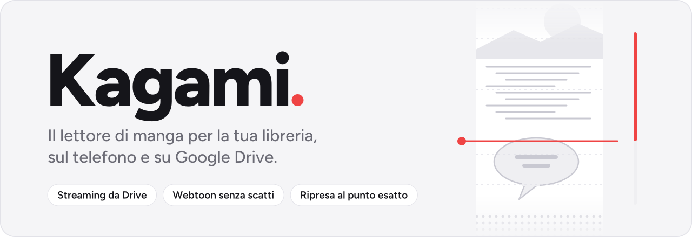
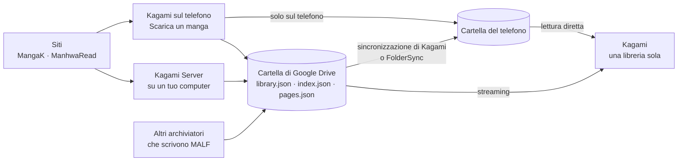
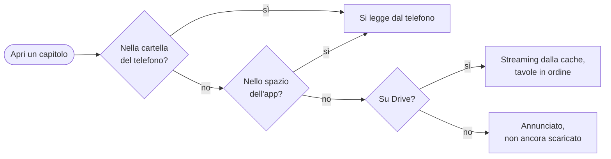

<p align="center">
  <picture>
    <source media="(prefers-color-scheme: dark)" srcset="docs/readme/banner-dark.svg">
    
  </picture>
</p>

<p align="center">
  <strong>La tua libreria di manga, sul telefono e su Google Drive, come una sola.<br>
  Letta senza scatti, ricordata al punto esatto, riempita da sé.</strong>
</p>

<p align="center">
  <a href="https://github.com/GabryXnLab/kagami/releases/latest"></a>
  <a href="https://github.com/GabryXnLab/kagami/actions/workflows/ci.yml"></a>
  <a href="LICENSE"></a>
  
  
  
</p>

<p align="center">
  <a href="#scaricare-e-installare"><b>Scarica</b></a> ·
  <a href="#funzionalità"><b>Funzionalità</b></a> ·
  <a href="#kagami-server"><b>Server</b></a> ·
  <a href="#il-formato-malf"><b>Formato MALF</b></a> ·
  <a href="#compilare-da-sé"><b>Compilare</b></a>
</p>

---

**Kagami** è un lettore di manga, manhwa e webtoon per Android. Presenta la tua
libreria come un lettore musicale presenta una discoteca: raccolte, ripresa
della lettura, stato e voto per ogni serie, cronologia e statistiche. La
libreria può stare in una cartella del telefono, su Google Drive (letta in
streaming) o in tutti e due i posti; e se è ancora vuota, Kagami la sa
riempire da sé, dal telefono o da un **Kagami Server** acceso su un tuo
computer.

Kagami non ospita e non indica contenuti: legge ciò che è nella tua cartella e
scarica solo ciò che gli chiedi. L'interfaccia è in italiano.

## Perché Kagami

- **Una libreria, due posti.** La cartella del telefono e quella di Google
  Drive diventano una libreria sola: le serie si uniscono, e ogni capitolo si
  apre dalla prima sorgente che ce l'ha. Da Drive si legge in streaming, e sul
  telefono scende solo ciò che scegli.
- **Webtoon lunghissimi, senza scatti.** Una tavola di webtoon arriva a 16 383
  pixel d'altezza: intera sarebbe una bitmap da cinquanta megabyte. Kagami non
  la decodifica mai tutta insieme, la legge a fasce di al più 512 pixel e ne
  tiene in memoria sei schermate. Quanto consuma dipende dallo schermo, non
  dalla tavola.
- **Riprendi dal punto, non dalla tavola.** Su un webtoon una tavola vale dieci
  schermate: Kagami ricorda anche quanto ne avevi già scorso, capitolo per
  capitolo, e la posizione viaggia con backup e account.
- **Offline è uno stato normale.** Senza rete la libreria di Drive si apre
  com'era, i capitoli in cache si leggono, e una tavola che manca lo dice al
  suo posto e ricompare da sola quando la rete torna. I download riprendono dal
  byte in cui si erano fermati.
- **Ricorda quello che leggi.** Stato, voto, raccolte, cronologia per giorno,
  statistiche e grafici. Backup e account si fondono senza perdere niente: un
  capitolo letto non torna mai da leggere.
- **Si riempie da sé.** Cerchi una serie o ne incolli il link, e Kagami la
  scarica su Drive o sul telefono, anche a schermo spento, e poi segue quelle
  in corso. Oppure la fa scaricare a Kagami Server, su un tuo computer sempre
  acceso, e il telefono può spegnersi.
- **Formato aperto.** La libreria è una cartella di file [MALF](docs/malf.md):
  immagini, manifest con SHA-256 per tavola e tre indici. Qualunque
  archiviatore che scrive MALF la può riempire, e i tuoi manga restano file
  tuoi, anche senza Kagami.
- **Niente pubblicità, niente analisi d'uso.** L'account è facoltativo, e cosa
  esce dal telefono è scritto [qui sotto](#cosa-esce-dal-telefono).

## Funzionalità

Quattro destinazioni: **Home**, **Libreria**, **Raccolte** e **Altro**
(cronologia, statistiche, impostazioni, Scarica un manga). Tema scuro di
partenza, perché si legge di sera; chiaro o come il sistema a scelta.

### Libreria

- Griglia comoda o fitta, elenco o elenco dettagliato; ordinamenti per
  aggiornamento, titolo, avanzamento, aggiunta, voto, capitoli da leggere,
  ultima lettura, numero di capitoli o a caso.
- Filtri a **tre stati** su generi, tag e autori (indifferente, richiesto,
  escluso: «shōnen ma non horror»), più stato, pubblicazione, voto minimo,
  capitoli nuovi o da leggere.
- Ricerca per titolo e autore, con prefissi: `tag:`, `genere:`, `autore:`,
  `stato:`, `tipo:`, `provider:`.
- Selezione multipla: letti, da leggere, stato, preferiti e raccolte su venti
  serie insieme.
- Raccolte come playlist, con nome, colore e ordine, accanto a quelle
  automatiche: *In lettura*, *Novità*, *Preferiti*, *Da iniziare*, *Finiti*.
- La Home propone *riprendi*, *aggiornamenti*, *da iniziare*, *arrivate di
  recente*, *lasciate a metà* e *altre così*.
- Scheda della serie con voto da 0 a 10, stato, preferito e note; quanto resta
  da leggere e quando è atteso il prossimo capitolo, dedotto dalla cadenza
  degli ultimi dieci; le serie simili per generi e tag.

### Lettore

- **Continuo** per i webtoon, con le tavole attaccate senza giunture, o
  **paginato** da destra a sinistra o da sinistra a destra. La modalità si
  sceglie per serie e si ricorda.
- Passaggio al capitolo seguente senza tornare all'elenco, con il precarico, e
  l'elenco dei capitoli dentro la lettura, con la sua ricerca.
- Zoom e doppio tocco, luminosità, colore di sfondo, adattamento della tavola,
  due tavole affiancate in orizzontale, blocco della rotazione, scorrimento
  automatico, segnalibri di pagina, schermo sempre acceso.
- Un capitolo si segna letto al 90%, perché l'ultima tavola è spesso una nota
  dell'autore. Finito un capitolo con dei precedenti non letti, Kagami chiede
  una volta se segnarli.
- Lettura in incognito, che non registra nulla.

### Drive e sincronizzazione

- Libreria **ibrida**: una serie locale con capitoli in più su Drive li mostra
  nella sua scheda e li legge da lì. Un'icona dice l'origine, e c'è solo
  quando Drive c'è.
- **Scarica** sul telefono un capitolo, una selezione o tutta la serie.
- Cache di Drive con un tetto (un gigabyte, regolabile) che sa cosa hai letto:
  i capitoli finiti escono per primi, il seguito di quelli a metà per ultimo.
- **Sincronizzazione della cartella** integrata: da Drive, verso Drive o in
  entrambe le direzioni, a mano o ogni giorno a un'ora, anche ad app chiusa e
  volendo solo col Wi-Fi. Le cancellazioni si propagano solo se lo chiedi, e
  su Drive finiscono nel cestino.
- **Libera spazio** propone di togliere dal telefono i capitoli già letti,
  dicendo quanti sono e quanto occupano. È l'unico punto in cui Kagami
  cancella qualcosa.

### Scaricare le serie

- Da **Altro → Scarica un manga**: cerchi un titolo (MangaK, ManhwaRead) o ne
  incolli il link, controlli copertina, autori e capitoli, e scegli.
- Tutta la serie, dal capitolo scelto in poi o solo i capitoli selezionati;
  sulla cartella di Drive, su Drive e sul telefono, o solo sul telefono.
- Una pausa regolabile fra le richieste, perché i siti bloccano chi scarica a
  raffica.
- La coda continua a schermo spento, con una notifica che dice a che punto è.
  Ripetere un download porta solo ciò che manca o è rovinato, e le tavole
  lasciano il telefono solo quando l'MD5 di Drive coincide.
- Le serie in corso si ricontrollano a mano o ogni giorno, e arrivano solo i
  capitoli nuovi.
- ManhwaRead sta spesso dietro la verifica di Cloudflare: la superi tu, in una
  pagina dentro l'app, e Kagami continua da lì.

### Dati personali

- Stato, voti, capitoli letti con la loro data, posizione in ogni capitolo,
  raccolte, segnalibri e impostazioni stanno in un database dell'app.
- **Cronologia** per giorno, il rovescio della scheda: lì si cerca il capitolo,
  qui si ritrova la serie.
- **Statistiche**: capitoli, tempo, tavole, giorni di fila, voto medio;
  capitoli per giorno o settimana su trenta giorni, tre mesi o un anno; il
  calendario dell'attività, stati e generi letti, l'istogramma dei voti, le
  serie più lette e com'è fatta la libreria.
- **Backup** in un file compresso da esportare dove vuoi, con un ripristino
  che dice cosa contiene e lascia scegliere fra fondere e sostituire, più una
  copia automatica al giorno dentro la libreria.
- **Account Google**, facoltativo: i dati seguono te e non il telefono. Si
  sincronizzano all'avvio, uscendo dall'app e a richiesta, non a ogni pagina
  girata. Su un telefono nuovo, al primo accesso, torna anche la libreria di
  Drive.

### Notifiche

- Sulla copertina, un pallino con il numero dei capitoli arrivati dall'ultima
  volta che hai aperto la serie.
- Una notifica per ogni serie seguita, aggiornata se ne arrivano altri e
  tolta aprendo la scheda. Ogni serie si può silenziare dalla campanella.
- Ad app chiusa Kagami guarda ogni ora la cartella del telefono, leggendo un
  file solo.

## Come funziona

Kagami non conosce i siti se non per scaricare: legge una cartella in formato
MALF, chiunque l'abbia scritta.



Le sorgenti si uniscono per serie e si risolvono per capitolo. Aprendo un
capitolo, Kagami prende la prima che ce l'ha davvero:



Un capitolo che l'indice annuncia e i file non hanno ancora è uno stato
normale, non un errore: la sincronizzazione può essere a metà, e l'app mostra
ciò che ha.

## Scaricare e installare

Gli APK firmati di ogni versione, con l'IPA per iOS e il file degli SHA-256,
sono nelle **[Releases](https://github.com/GabryXnLab/kagami/releases/latest)**.

### Android

| File | Per chi |
| :--- | :--- |
| `kagami-<versione>-arm64-v8a.apk` | quasi ogni telefono Android dal 2017 in poi. **Nel dubbio, questo.** |
| `kagami-<versione>-armeabi-v7a.apk` | telefoni a 32 bit, vecchi o economici |
| `kagami-<versione>-x86_64.apk` | emulatori e pochi tablet con processore Intel |
| `kagami-<versione>-universal.apk` | tutte e tre le architetture in un file solo, più pesante |

**Scegli un tipo di APK e restaci.** Gli APK per architettura hanno un
`versionCode` più alto di mille (o duemila, o quattromila) rispetto
all'universale: si installano sopra l'universale, ma l'universale non si
installa mai sopra di loro, nemmeno in una versione successiva. Per cambiare
tipo si disinstalla, dopo aver esportato un backup.

Al primo avvio Kagami chiede l'**accesso a tutti i file**. Serve a leggere la
cartella dei manga direttamente: la via alternativa di Android, lo Storage
Access Framework, costa una chiamata di sistema per ogni file, e una libreria
sono decine di migliaia di immagini. Fuori dal suo spazio Kagami scrive solo
ciò che gli chiedi: i capitoli che scarichi, quelli letti che togli, ciò che
porta la sincronizzazione se l'hai accesa. Poi si sceglie la cartella, oppure
si collega Drive da *Altro → Impostazioni → Google Drive*.

### iOS

`kagami-<versione>-ios-unsigned.ipa` **non è firmato**, perché firmarlo
richiede un account Apple Developer: lo firmi tu mentre lo installi, con
[AltStore](https://altstore.io) o [Sideloadly](https://sideloadly.io) e il tuo
Apple ID. Con un Apple ID gratuito l'app dura sette giorni, poi va rifirmata.

La versione iOS è sperimentale: account e Drive restano spenti (il loro
servizio si accende solo su Android), e mancano le notifiche e i lavori in
background, cioè la coda dei download e la sincronizzazione programmata.

### Verificare il download

Il file `kagami-<versione>.sha256` della release elenca le impronte di tutti
gli APK e dell'IPA:

```bash
sha256sum -c kagami-1.0.2.sha256 --ignore-missing
```

Tutte le release sono firmate con la stessa chiave, e le note di ognuna
riportano l'impronta del certificato. Con gli strumenti dell'SDK Android:

```bash
apksigner verify --print-certs kagami-1.0.2-arm64-v8a.apk | grep 'SHA-256 digest'
# … certificate SHA-256 digest: d8138e24e6f4ea0613d6024824b1ac98e99c87b43071214d2fa7a55d14ca3124
```

Un APK con un'altra firma non viene da questa pagina, e Android non lo
installerebbe comunque sopra quello ufficiale.

### Cosa esce dal telefono

- **Niente pubblicità né analisi d'uso.** Kagami non contiene librerie di
  pubblicità o di analytics.
- **Errori e crash.** Le release ufficiali mandano a [Sentry](https://sentry.io)
  gli errori, i crash e un campione delle misure di prestazione, per poterli
  correggere; l'app non ha un interruttore per spegnerlo. Una build compilata
  da sé senza `SENTRY_DSN` non manda niente.
- **Account, solo se accedi.** I dati personali viaggiano come lo stesso file
  del backup, compresso, in un documento Firestore che le
  [regole](firestore.rules) lasciano leggere e scrivere soltanto a te. Nelle
  release ufficiali il progetto Firebase è quello del manutentore; per usarne
  uno tuo si [compila da sé](#compilare-da-sé).
- **Google Drive** si legge con il tuo token e il permesso di sola lettura;
  quello di scrittura si chiede solo quando scegli una sincronizzazione che
  carica su Drive o un download con destinazione Drive.
- **I siti** li contatta solo quando cerchi o scarichi una serie.

## Kagami Server

Una serie intera sono ore di download, e il telefono dovrebbe restare acceso e
in rete per tutto il tempo. **Kagami Server** è un programma da tenere acceso
su un computer qualsiasi (un mini PC, un NAS, un Raspberry Pi, una VPS): il
telefono sceglie cosa scaricare, il server lo scarica e lo carica nella
cartella di Drive della libreria, e il telefono può spegnersi. È lo stesso
motore dell'app, quindi scrive la stessa libreria e convive con i download
fatti dal telefono.

```bash
git clone https://github.com/GabryXnLab/kagami.git
cd kagami/server
docker compose up -d
docker compose logs kagami-server        # la prima chiave API: copiala subito
docker compose exec kagami-server kagami-server drive login
docker compose exec kagami-server kagami-server drive folder <link della cartella>
docker compose exec kagami-server kagami-server key create "Telefono" --url <indirizzo>
```

L'ultimo comando stampa un link `kagami://server?…` con indirizzo e chiave:
nell'app, *Altro → Scarica un manga → Server*, lo incolli e il server compare
come destinazione, con la sua coda sotto quella del telefono.

- **Drive con un permesso suo**, che non scade quando il telefono si spegne:
  serve un client OAuth tuo, cinque minuti una volta sola
  ([come](docs/server.md#2-dare-al-server-il-permesso-di-drive)).
- **Una chiave per dispositivo**, revocabile da sola; sul disco del server ne
  resta solo l'impronta SHA-256.
- **Raggiungibile** in casa, con [Tailscale](https://tailscale.com) anche senza
  un dominio né porte aperte, o dietro un reverse proxy con HTTPS
  ([i casi](docs/server.md#3-farlo-raggiungere-dal-telefono)).
- **Segue le serie in corso** che ha scaricato, una volta al giorno, e dopo un
  riavvio riprende da dove era senza riscaricare ciò che è già su Drive.
- Senza Docker è un eseguibile unico: `dart compile exe`, su Linux, macOS o
  Windows.

Guida completa: [docs/server.md](docs/server.md) · Protocollo:
[docs/server-api.md](docs/server-api.md), aperto a qualunque altro server che
risponda allo stesso modo.

## Il formato MALF

La libreria di Kagami è una cartella in formato **MALF**, specificato in
[docs/malf.md](docs/malf.md). L'archivio vero sono le immagini e i loro
manifest, con lo SHA-256 di ogni tavola; accanto ci sono tre indici derivati,
che rispondono in una lettura sola alle tre domande di un lettore:

| Domanda | File | Costo |
| :--- | :--- | :--- |
| Cosa c'è in libreria? | `library.json` | 1 lettura |
| Cosa c'è in questa serie? | `<serie>/index.json` | 1 lettura |
| Quali pagine ha questo capitolo? | `<serie>/pages.json` | 1 lettura, solo entrando in lettura |

Senza indici, disegnare la griglia di una libreria di 80 serie da 150 capitoli
vorrebbe dire aprire 12 000 file. `pages.json` porta anche larghezza e altezza
di ogni tavola, così il lettore riserva lo spazio di scorrimento prima di
decodificare un pixel, e le tavole alte possono avere le loro **tessere**, già
tagliate.

<details>
<summary>Com'è fatta una libreria</summary>

```text
Libreria/
  library.json                    indice di libreria
  reading/                        spazio del lettore: backup automatici
  Titolo della serie [provider-id]/
    series.json                   manifest completo
    index.json                    capitoli, senza pagine
    pages.json                    pagine per capitolo, con le dimensioni
    cover.webp
    cover.thumb.webp              miniatura, è ciò che legge la griglia
    chapters/
      0001 - Chapter 1 [id]/
        chapter.json              manifest del capitolo, SHA-256 per tavola
        0001.webp
```

Più archiviatori possono scrivere nella stessa cartella di Drive: le regole
con cui convivono sono in [docs/malf.md](docs/malf.md#chi-scrive).

</details>

## Compilare da sé

Nel repo non c'è nessun servizio del manutentore: progetto Firebase, Sentry,
chiave di firma e server sono di chi compila. Tutto ciò che segue è
facoltativo, e l'app si adatta a quello che trova.

| Con | L'app ha |
| :--- | :--- |
| niente | libreria in una cartella del telefono, lettore, stato, voti, raccolte, cronologia, statistiche, backup su file, download dai siti sul telefono |
| `android/app/google-services.json` | in più: accesso con Google, dati personali che seguono il lettore, libreria su Drive, sincronizzazione della cartella, download verso Drive |
| `--dart-define=SENTRY_DSN=…` | in più: errori e crash sul proprio progetto Sentry |
| un Kagami Server | in più: download fatti da un computer acceso invece che dal telefono |

### Compilare l'APK

Serve Flutter 3.47 (Linux, macOS o Windows; x64 o arm64) con l'SDK Android e
Java 17, oppure il devcontainer in `.devcontainer/` (Codespaces compreso):

```bash
flutter pub get
flutter build apk --release                             # --dart-define=SENTRY_DSN=… se vuoi Sentry
flutter build apk --release --split-per-abi             # un APK per architettura
```

Senza altro, la release si firma con la chiave di debug della macchina. Per
firmare con la propria si crea `android/key.properties`, che git ignora:

```properties
storeFile=/percorso/della/chiave.jks
storePassword=…
keyAlias=…
keyPassword=…
```

### Con la CI di un fork

Senza una macchina adatta si fa un fork e si lancia **CI** dalla scheda
Actions: l'APK arriva fra gli artefatti del run. In un fork pubblico, **Build**
fa a ogni push su `main` gli APK per architettura, l'universale e l'IPA non
firmata. I secret sono tutti facoltativi:

<details>
<summary>Quali secret accendono cosa</summary>

| Secret | Senza | Con |
| :--- | :--- | :--- |
| `GOOGLE_SERVICES_JSON` | APK senza account né Drive | il contenuto di `google-services.json` del proprio progetto Firebase |
| `ANDROID_KEYSTORE` | chiave nuova a ogni run: l'APK non si installa sopra il precedente e l'accesso con Google fallisce | il keystore con cui firmare, in base64 (`base64 -w0 <file>`); la sua SHA-1 va registrata in Firebase e il run la scrive nel riepilogo |
| `ANDROID_KEYSTORE_PASSWORD`, `ANDROID_KEY_ALIAS`, `ANDROID_KEY_PASSWORD` | quelli di una chiave di debug (`android`, `androiddebugkey`) | quelli della propria chiave di release |
| `SENTRY_DSN` | Sentry spento | errori e crash sul proprio progetto Sentry |

I dettagli dei workflow sono in
[.github/workflows/CLAUDE.md](.github/workflows/CLAUDE.md).

</details>

### Account e Drive: il proprio progetto Firebase

<details>
<summary>Sei passi, una volta sola</summary>

1. Su <https://console.firebase.google.com> crea un progetto.
2. *Authentication → Metodo di accesso*: attiva **Google**.
3. *Firestore Database*: crea il database, poi carica le regole del repo, che
   lasciano a ognuno solo il proprio documento:
   `firebase deploy --only firestore:rules --project <id-del-progetto>`.
4. *Impostazioni del progetto → Aggiungi app → Android*: pacchetto
   `dev.local.kagami` e l'impronta SHA-1 della chiave con cui firmi l'APK.
   Per la chiave di debug:
   `keytool -list -v -keystore ~/.android/debug.keystore -alias androiddebugkey -storepass android`.
   Una chiave diversa, una SHA-1 in più: con una chiave non registrata
   l'accesso con Google fallisce.
5. Scarica `google-services.json` (dopo il passo 2, perché contenga il client
   di Google) e mettilo in `android/app/`. Git lo ignora.
6. Per Drive, sulla [console di Google Cloud](https://console.cloud.google.com)
   dello stesso progetto: abilita **Google Drive API**, e nella schermata di
   consenso OAuth aggiungi gli scope `drive.readonly` e `drive` e il tuo
   account fra gli utenti di test.

Ricompila, e in *Altro → Impostazioni* compaiono «Account» e «Google Drive».

</details>

### Analisi e test

```bash
flutter pub get
dart run build_runner build      # dopo ogni modifica allo schema del database
flutter analyze && flutter test
(cd packages/kagami_archive && dart analyze && dart test)
(cd server && dart pub get && dart analyze && dart test)
docker build -f server/Dockerfile --target test .    # i test del server con libvips
```

## Architettura

Flutter e Dart, stato con Riverpod, dati personali su SQLite con drift,
interfaccia Material 3 vestita da un kit di componenti proprio, carattere
Figtree e icone Lucide.

<details>
<summary>Com'è organizzato il codice</summary>

```text
lib/                     l'app Flutter
  src/format/            i modelli di MALF e dello stato di lettura
  src/data/              sorgenti (cartella, spazio dell'app, Drive), database,
                         backup, account, sincronizzazione, notifiche
  src/ui/                schermate, lettore, kit di componenti
packages/kagami_archive/ l'archiviatore in Dart puro: provider dei siti, motore,
                         indici, destinazioni, coda
server/                  Kagami Server, Dart puro: API, chiavi, Drive, coda
android/                 il Kotlin: decodifica a fasce, tessere, lavori in background
docs/                    design, formato MALF, server e protocollo
```

- **Un motore, due case.** L'archiviatore è un pacchetto Dart senza Flutter,
  così lo usano sia l'app sia il server, che Flutter non ha. Ciò che il
  telefono aggiunge (immagini, token, rete, segnalazione degli errori) gli
  arriva da fuori, per interfaccia.
- **Indici, non scansioni.** La libreria resta fuori dal database: gli indici
  MALF sono già la forma indicizzata. Nel database stanno solo i dati
  personali, una riga per capitolo letto con la sua data, ed è da lì che
  vengono cronologia e statistiche.
- **Il lettore a fasce.** Ogni fascia si prende dalla prima fonte che ce l'ha:

  ```mermaid
  flowchart LR
    t1["Tessera dell'archivio<br/>(MALF tiles)"] --> t2["Tavola intera,<br/>se è bassa"]
    t2 --> t3["Tessera tagliata<br/>dal telefono"]
    t3 --> t4["Ritaglio nativo<br/>(Kotlin)"]
  ```

  Le prime tre sono file che il codec di Flutter decodifica fuori dal thread
  dell'interfaccia; il ritaglio nativo resta per le tavole alte che nessuno ha
  ancora tagliato. Le righe sono le stesse da ogni fonte, quindi una che manca
  passa alla seguente senza muovere la striscia.
- **Drive si paga in richieste, non in byte.** All'apertura, due richieste per
  tutta la libreria; elenchi e indici su disco, un'istantanea che apre la
  griglia subito e Drive riletto dietro.
- **L'account è il backup che va e torna.** Su Firestore va lo stesso file
  dell'esportazione, e due copie si fondono con le regole del ripristino, già
  provate.

Le funzionalità attese, le scelte e i loro perché sono in
[docs/design.md](docs/design.md); struttura, comandi e vincoli del progetto in
[CLAUDE.md](CLAUDE.md).

</details>

## Contribuire

Issue e pull request sono benvenute. Lo sviluppo avviene in un repo privato, e
questo repo riceve le modifiche come pull request di sincronizzazione, un
commit ciascuna. Una pull request di un contributore si apre e si unisce qui
come sempre, e viene poi riportata nel repo di sviluppo.

- Codice e identificatori in inglese, commenti e documentazione in italiano; i
  commenti spiegano il perché, non il cosa.
- `flutter analyze` senza segnalazioni e i test verdi, anche quelli di
  `packages/kagami_archive` e `server` se li tocchi.
- Il formato si cambia prima in [docs/malf.md](docs/malf.md), il protocollo
  del server prima in [docs/server-api.md](docs/server-api.md).
- Un sito nuovo si aggiunge come provider in `packages/kagami_archive/`.

## Licenza e crediti

Kagami è software libero sotto licenza [GPL-3.0](LICENSE).

- Carattere [Figtree](https://github.com/erikdkennedy/figtree), sotto
  [SIL OFL 1.1](fonts/OFL.txt).
- Icone [Lucide](https://lucide.dev), sotto licenza ISC.
- Le icone dei siti in `assets/providers/` sono marchi dei rispettivi
  proprietari, usati solo per riconoscerli.

Kagami scarica da siti di terzi solo ciò che l'utente gli chiede: rispettare i
diritti su ciò che si scarica, e le condizioni di quei siti, è compito di chi
lo usa.
